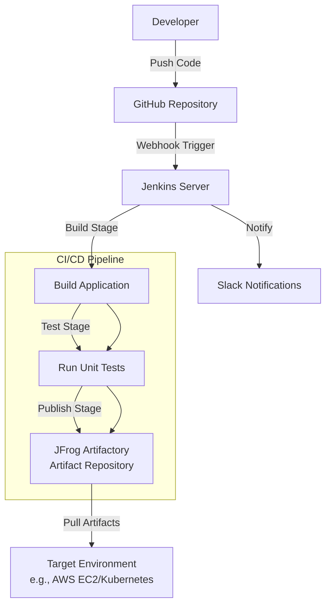

# JFrog-Jenkins-Artifact-Demo


A production-ready demonstration of a CI/CD pipeline integrating **Jenkins** with **JFrog Artifactory** for automated artifact management. This project showcases building, testing, and deploying a sample application, with artifacts (e.g., Docker images or binaries) stored in Artifactory for reliable distribution.

## 🚀 Overview

This repository provides a complete CI/CD pipeline using **Jenkins** to automate the build, test, and deployment of a sample application, with **JFrog Artifactory** as the artifact repository. The pipeline includes GitHub integration for triggering builds, unit testing, artifact publishing to Artifactory, and deployment to a target environment (e.g., AWS EC2 or Kubernetes). The setup emphasizes DevOps best practices, security, and scalability.

### Key Features
- **Automated CI/CD Pipeline**: Jenkins pipeline triggered by GitHub commits, with stages for build, test, and artifact publishing.
- **JFrog Artifactory Integration**: Stores and manages artifacts (e.g., Docker images, JAR files) with version control.
- **Sample Application**: A simple application (e.g., Python Flask or Java app) for demonstration purposes.
- **Security Practices**: Credentials managed via Jenkins credentials store and Artifactory API keys.
- **Monitoring and Notifications**: Slack integration for build status updates and pipeline monitoring.
- **Infrastructure as Code**: Optional Terraform configuration for provisioning Jenkins/Artifactory infrastructure on AWS.

## 🏗️ Architecture



## 📋 Prerequisites

Before setting up the pipeline, ensure you have:
- **Jenkins** (v2.426 or later) installed and configured with plugins:
  - Git Plugin
  - Pipeline Plugin
  - Artifactory Plugin
  - Slack Notification Plugin
- **JFrog Artifactory** (v7.x or later) instance (self-hosted or cloud).
- **AWS CLI** (optional, for AWS-based deployments).
- **Docker** (optional, for containerized applications).
- **GitHub Repository** with webhook configured for Jenkins.
- **Terraform** (v1.5 or later, optional for infrastructure provisioning).
- **Credentials**:
  - Artifactory API key or username/password.
  - AWS credentials (if deploying to AWS).
  - Slack webhook URL for notifications.

## 🚀 Quick Start

### 1. Clone the Repository
```bash
git clone https://github.com/soodrajesh/JFrog-Jenkins-Artifact-Demo.git
cd JFrog-Jenkins-Artifact-Demo
```

### 2. Configure Jenkins
1. **Install Plugins**:
   - In Jenkins, go to `Manage Jenkins` > `Manage Plugins` and install the required plugins (Git, Pipeline, Artifactory, Slack).
2. **Add Credentials**:
   - Add Artifactory credentials: `Manage Jenkins` > `Manage Credentials` > Add Artifactory API key or username/password (ID: `artifactory-cred`).
   - Add Slack webhook URL: Configure under `Manage Jenkins` > `Configure System` > `Slack`.
   - Add AWS credentials (if needed): ID `aws-cred`.
3. **Set Up Webhook**:
   - In your GitHub repository, go to `Settings` > `Webhooks` > `Add Webhook`.
   - Set `Payload URL` to `http://<jenkins-url>/github-webhook/` and select `Push` events.

### 3. Configure Artifactory
1. Create a repository in Artifactory (e.g., `generic-local` or `docker-local`) for storing artifacts.
2. Note the repository URL (e.g., `https://<your-artifactory>.jfrog.io/artifactory/generic-local`).

### 4. Deploy the Pipeline
1. **Copy Pipeline Configuration**:
   - Copy the `Jenkinsfile` from the repository to your Jenkins project.
   - Example `Jenkinsfile` structure:
     ```groovy
     pipeline {
         agent any
         environment {
             ARTIFACTORY_CRED = credentials('artifactory-cred')
         }
         stages {
             stage('Checkout') {
                 steps { git 'https://github.com/soodrajesh/JFrog-Jenkins-Artifact-Demo.git' }
             }
             stage('Build') {
                 steps { sh 'make build' }
             }
             stage('Test') {
                 steps { sh 'make test' }
             }
             stage('Publish to Artifactory') {
                 steps {
                     rtUpload (
                         serverId: 'artifactory',
                         spec: '''{
                             "files": [
                                 {
                                     "pattern": "build/*",
                                     "target": "generic-local/"
                                 }
                             ]
                         }'''
                     )
                 }
             }
             stage('Notify') {
                 steps { slackSend(message: "Build #${env.BUILD_NUMBER} completed") }
             }
         }
     }
     ```
2. **Run the Pipeline**:
   - Create a new Jenkins pipeline job, point it to your repository, and trigger a build.

### 5. (Optional) Deploy Infrastructure with Terraform
If provisioning Jenkins/Artifactory on AWS:
```bash
cd terraform
terraform init
terraform apply -var-file="terraform.tfvars"
```

### 6. Access Artifacts
- Log in to Artifactory and navigate to the repository (e.g., `generic-local`) to view uploaded artifacts.
- Deploy artifacts to a target environment (e.g., EC2 or Kubernetes) using the Artifactory URL.

## 📁 Project Structure
```
JFrog-Jenkins-Artifact-Demo/
├── Jenkinsfile            # Jenkins pipeline definition
├── src/                  # Sample application code (e.g., Flask app)
│   ├── app.py            # Sample Python application
│   └── requirements.txt  # Dependencies
├── terraform/            # (Optional) Terraform configs for Jenkins/Artifactory
│   ├── main.tf           # Infrastructure configuration
│   ├── variables.tf      # Input variables
│   └── outputs.tf        # Output values
├── Makefile              # Build and test scripts
├── README.md             # This file
└── .gitignore            # Git ignore rules
```

## 🔒 Security Best Practices
- **Credential Management**: Store Artifactory and AWS credentials in Jenkins credentials store.
- **Least Privilege**: Use IAM roles with minimal permissions for AWS resources.
- **Encrypted Artifacts**: Enable encryption for Artifactory repositories.
- **Network Security**: Restrict Jenkins and Artifactory access to trusted IPs or VPCs.
- **Audit Logging**: Enable Artifactory audit logs and Jenkins pipeline logs for traceability.

## 📊 Monitoring and Maintenance
- **Jenkins Build Logs**: View in Jenkins UI or via `Manage Jenkins` > `System Log`.
- **Artifactory Logs**: Check Artifactory UI for artifact access and upload logs.
- **Slack Notifications**: Receive real-time build status updates.
- **Health Checks**: Monitor Jenkins (`http://<jenkins-url>/health`) and Artifactory (`http://<artifactory-url>/api/system/ping`).
- **Pipeline Metrics**: Use Jenkins plugins (e.g., Pipeline Stage View) for performance insights.

## 🧹 Cleanup
To avoid costs (if using AWS):
```bash
cd terraform
terraform destroy -var-file="terraform.tfvars"
```
Manually delete Jenkins jobs or Artifactory repositories if not using Terraform.

## 🔍 Troubleshooting
- **Pipeline Failures**:
  - Check Jenkins build logs: `http://<jenkins-url>/job/<job-name>/<build-number>/console`.
  - Verify Artifactory credentials: `rtServer` configuration in Jenkins.
- **Artifactory Upload Issues**:
  - Ensure repository exists and permissions are correct.
  - Run `curl -u <user>:<api-key> <artifactory-url>/api/system/ping` to test connectivity.
- **Webhook Issues**:
  - Verify GitHub webhook URL and events in `Settings` > `Webhooks`.
- **Debug Commands**:
  ```bash
  # Test Jenkins CLI
  java -jar jenkins-cli.jar -s http://<jenkins-url> who-am-i
  # Test Artifactory connectivity
  curl -u <user>:<api-key> <artifactory-url>/api/storage/generic-local
  ```

## 🤝 Contributing
1. Fork the repository.
2. Create a feature branch: `git checkout -b feature/your-feature`.
3. Commit changes: `git commit -m 'Add your feature'`.
4. Push to the branch: `git push origin feature/your-feature`.
5. Submit a pull request.

## 📄 License
This project is licensed under the MIT License - see the [LICENSE](LICENSE) file for details.

## 🆘 Support
For issues:
- Check the [troubleshooting section](#troubleshooting).
- Review [Jenkins](https://www.jenkins.io/doc/) and [JFrog Artifactory](https://www.jfrog.com/confluence/) documentation.
- Open a GitHub issue for bugs or questions.

⭐ If this project helps you, please give it a star!

## 🙏 Acknowledgments
- Jenkins community for robust CI/CD tools.
- JFrog Artifactory for reliable artifact management.
- Built with ❤️ for the DevOps community.
