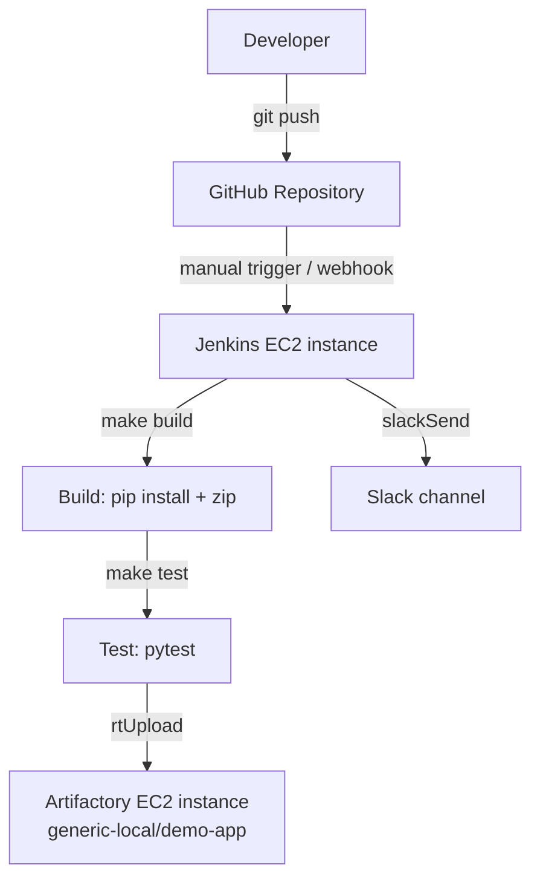

# JFrog-Jenkins-Artifact-Demo

A small Flask app built and published through a self-hosted Jenkins + JFrog Artifactory pipeline. Terraform stands up two EC2 instances (one for Jenkins, one for Artifactory OSS), and the Jenkinsfile does the actual work: checkout, build, test, and upload the resulting zip to an Artifactory generic repo, with a Slack notification at the end.

I built this to have a working example of the "classic" self-hosted CI/CD stack — Jenkins driving the pipeline, Artifactory as the binary repository — rather than relying on a SaaS build service and a managed registry. It's a demo, not something I'd run as-is for a real team.

## What this actually does

The pipeline in `Jenkinsfile` has five stages: checkout the repo, run `make build` (installs the Python dependencies and zips up `src/`), run `make test` (pytest against the Flask app), upload `build/*.zip` to Artifactory's `generic-local/demo-app/` path via the Artifactory plugin's `rtUpload` step, and post a Slack message. On failure it posts a Slack message too.

There is no deploy stage. The artifact lands in Artifactory and stops there — pulling it down to an EC2 instance, a container, or wherever it's actually meant to run is a manual step (or another job) that isn't in this repo.

## Architecture


```mermaid
graph TD
    A[Developer] -->|git push| B[GitHub Repository]
    B -->|manual trigger / webhook| C[Jenkins EC2 instance]
    C -->|make build| D[Build: pip install + zip]
    D -->|make test| E[Test: pytest]
    E -->|rtUpload| F[Artifactory EC2 instance<br/>generic-local/demo-app]
    C -->|slackSend| G[Slack channel]
```

Both Jenkins and Artifactory run as plain EC2 instances provisioned by Terraform (`terraform/main.tf`), installed via `user_data` shell scripts — Jenkins from the official yum repo, Artifactory OSS 7.71.10 downloaded as a tarball and started directly with `artifactory.sh start`. There's no container orchestration, no load balancer, no auto scaling group — each service is one instance, reachable on its own security group (8080 for Jenkins, 8081-8082 for Artifactory).

I went with self-hosted EC2 instances instead of JFrog Cloud or something like AWS CodeArtifact/ECR because the point of this repo is to show the mechanics of wiring Jenkins to Artifactory yourself — installing it, configuring the credentials, writing the `rtUpload` spec — rather than consuming someone else's managed pipeline integration. That's also the tradeoff: a managed registry gives you HA, patching, and auth out of the box, and you'd lose all of that here. If I were doing this for a team I'd actually rely on, I'd put Artifactory behind an ALB with at least two nodes, or just use a managed registry and skip this problem entirely.

## Known gaps

- **No deploy stage.** The README used to imply this pipeline deploys to EC2 or Kubernetes; it doesn't. It publishes an artifact and stops.
- **No HA.** Jenkins and Artifactory are each a single EC2 instance. If either one dies, that's it until someone relaunches it.
- **Plain HTTP, no TLS.** Both services are exposed on their raw ports (8080, 8081/8082) with no reverse proxy or certificate in front of them.
- **Security groups are wide open.** Both `jenkins_sg` and `artifactory_sg` allow inbound 22 and the service ports from `0.0.0.0/0`. Fine for a throwaway demo, not fine for anything else.
- **No Terraform state locking.** `main.tf` creates an S3 bucket (`jfrog-jenkins-demo-tf-state`) for state, but there's no `backend "s3"` block wiring it up, and no DynamoDB lock table. As written, state is local and the bucket does nothing.
- **Hardcoded AMI ID.** `ami-0abcdef1234567890` is a placeholder — you have to replace it with a real AMI for your region before `terraform apply` will work.
- **Manual credential and webhook setup.** The Jenkins credential (`artifactory-cred`), the Artifactory server URL in the `rtServer` step, the Slack integration, and the GitHub webhook all have to be configured by hand; none of that is code.
- **No CI trigger defined.** The Jenkinsfile has no `triggers` block, so nothing runs automatically on push unless you configure a webhook-driven job in the Jenkins UI yourself.
- **Artifactory OSS install pulls from a legacy Bintray-style URL** (`releases.jfrog.io/artifactory/bintray-artifactory/...`). JFrog has moved release hosting around over the years; verify that path still resolves before relying on it.
- **No tests for the infrastructure.** `pytest` covers the Flask route; there's nothing checking the Terraform or the pipeline itself.

## Project structure

```
JFrog-Jenkins-Artifact-Demo/
├── Jenkinsfile              # Checkout -> build -> test -> publish to Artifactory -> Slack notify
├── src/
│   ├── app.py                # Flask app (single "/" route)
│   ├── test_app.py            # pytest test for the Flask route
│   ├── makefile                # build/test/clean targets used by the Jenkinsfile
│   └── requirements.txt        # flask, pytest
├── terraform/
│   ├── main.tf                # EC2 for Jenkins, EC2 for Artifactory OSS, security groups, state bucket
│   ├── variables.tf            # aws_region (default eu-west-1), key_name
│   └── outputs.tf              # public IPs for both instances
└── README.md
```

## How to run this

Provision the infrastructure:

```bash
cd terraform
terraform init
terraform apply -var="key_name=<your-ec2-key-pair>"
```

This gives you a Jenkins box and an Artifactory box, both with public IPs (see `terraform output`). SSH into the Artifactory instance if you need to check on it — Artifactory OSS is started directly via `artifactory.sh start`, there's no systemd unit set up for it here.

On the Jenkins side: install the Git, Pipeline, Artifactory, and Slack plugins, add a credential with ID `artifactory-cred` for your Artifactory user, and update the `rtServer` URL in the `Jenkinsfile` to point at your Artifactory instance's IP. Then create a pipeline job pointing at this repo's `Jenkinsfile` and run it.

Locally, without any of the infrastructure, you can just run the app and its tests:

```bash
pip install -r src/requirements.txt
PYTHONPATH=. pytest src/test_app.py
python src/app.py
```

## Cleanup

```bash
cd terraform
terraform destroy -var="key_name=<your-ec2-key-pair>"
```

Terraform doesn't touch anything inside Artifactory or Jenkins (repositories, jobs, credentials) — those go away with the instances, but if you've pointed the state bucket at anything real, delete that separately.
